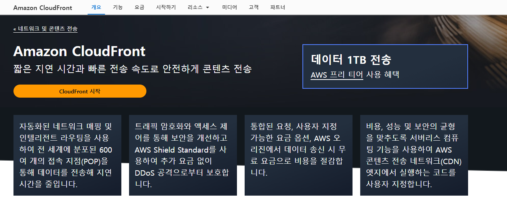

**웹 개발 프로젝트** 를 하신 분들은 웹 개발 프로젝트에서 코드를 작성한 것은 시작에 불과하는 것에 공감 하실 것입니다. 

**Flask** 를 이용해서 원하는 기능을 개발하고, 최적화를 시킨 이후에  
**HTML**과 **CSS** 그리고 **Java Script** 를 이용해서 사용자 인터페이스(UI)와 디자인, 기능들을 구현해야 합니다. 

이런 과정들을 겪고 나면 최종적으로 **배포 (Deployment)**를 진행해야 합니다. 

지금까지는 개발 서버 (ex. localhost:5000)를 이용해서 우리의 웹사이트에 접근을 하고 서비스를 이용할 수 있지만 다른 사람들이 접근하려면 배포하는 과정을 거쳐야 합니다.

이번 포스팅은 저의 웹사이트의 배포과정이 담겨 있습니다. 

## AWS (Amazon Web Service)

우선 저는 **AWS(Amazon Web Service)** 를 이용해서 배포를 했습니다. 
AWS와 같은 클라우드 서비스를 이용하는 대표적인 이유는 배포를 위해선 서버가 필요한데, 서버를 위탁하지 않고 직접 관리하는 **On-Premise** 방식을 사용하면 직접 서버를 설치하고 관리해야 하기 때문에, 이러한 과정을 생략하기 위해 **Off-Premise** 방식을 사용했습니다.

대표적인 클라우드 서비스로는 Microsoft의 **Azure**, Google의 **Google Cloud** 그리고 제가 사용하는 Amazon의 **AWS**가 있습니다.  

### Launch Instance

서버를 열기 위해선 클라우드 서비스에서 제공하는 서버 리소스인 **인스턴스**가 필요합니다.  

